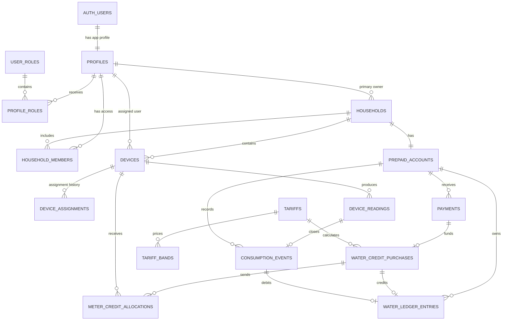

# Prepaid water data model

Supabase Auth users live in `auth.users`. Application profiles use the same UUID
as their primary key, so `public.profiles.id` references `auth.users.id`.

## Relationship overview

## Why these tables are separate

- `profiles`: personal application data and authorization role. Email and
  passwords remain in Supabase Auth.
- `user_roles` and `profile_roles`: normalized many-to-many application roles;
  role codes include `house-owner`, `admin`, `household-manager`,
  `household-viewer`, `meter-operator`, and `billing-officer`.
- `households` and `household_members`: one primary account holder plus optional
  managers/viewers without duplicating a household.
- `devices` and `device_assignments`: current meter placement plus an audit
  history when a meter is replaced or moved.
- `device_readings`: immutable meter telemetry. `cumulative_litres` is the raw
  meter truth; `interval_litres` is the calculated difference.
- `prepaid_accounts`: the water entitlement account for a household.
- `tariffs` and `tariff_bands`: versioned pricing, including stepped rates.
- `payments`, `payment_events`, and `payment_refunds`: financial state,
  idempotent provider callbacks, and refunds. Raw provider events are
  administrator-only.
- `water_credit_purchases`: the exact litres bought by a successful payment and
  a snapshot of the pricing used at that moment.
- `meter_credit_allocations`: delivery of bought credit to a physical meter.
- `consumption_events`: auditable usage derived between meter readings.
- `water_ledger_entries`: immutable litre credits and debits. The balance is
  calculated by `prepaid_account_balances`, never trusted from a user-editable
  column.
- `daily_water_usage`: household-local daily consumption totals for charts and
  reports, derived from validated consumption events.

## Core transaction flows

### Buying water

1. `createPaymentIntent(...)` creates a pending payment with a unique
   `idempotency_key`.
2. The SvelteKit webhook route validates the provider signature.
3. `settlePaymentAndCreditWater(...)` records the provider event, marks the
   payment successful, creates the `water_credit_purchases` row, and posts the
   positive ledger entry in one code-owned database transaction.
4. `allocatePurchasedCredit(...)` checks household/device ownership and prevents
   allocations from exceeding the purchased volume.

### Recording usage

1. The SvelteKit ingestion route validates the TTN/webhook request.
2. `ingestDeviceReading(...)` stores each unique uplink in `device_readings`.
3. The code compares the new cumulative value to the previous reading and flags
   meter resets rather than creating negative usage.
4. The same transaction creates the consumption event and posts its negative
   ledger entry.

### Corrections and refunds

Application code never updates or deletes a ledger row.
`reverseLedgerEntry(...)` posts an equal and opposite `reversal` linked through
`reversal_of_id`. A financial refund does not automatically remove litres; the
business service decides whether unused entitlement should also be debited.

## Security model

- Supabase RLS lets household members read only their household, devices,
  readings, payments, credits, consumption, and ledger.
- The browser Data API has no write grants for domain, payment, metering, or
  ledger tables.
- SvelteKit authenticates the user, checks role/household access in code, then
  executes mutations through the server-only `SUPABASE_DB_URL`.
- Payment webhooks and meter ingestion are validated by SvelteKit routes before
  calling the transactional services.
- Device assignment uses a composite foreign key, ensuring the assigned profile
  is a member of the same household.
- The database migration creates no runtime functions, triggers, or Edge
  Functions.

## CRUD policy matrix

| Data                             | Browser Data API                  | SvelteKit server code               |
| -------------------------------- | --------------------------------- | ----------------------------------- |
| Own profile                      | Read and update safe fields       | Create, update roles/status, delete |
| Role catalogue and assignments   | Read catalogue and own roles      | Administrator assignment/removal    |
| Households and members           | Read accessible household         | Authorized administrator CRUD       |
| Devices and assignments          | Read household devices            | Authorized administrator CRUD       |
| Prepaid accounts                 | Read household account            | Authorized administrator CRUD       |
| Tariffs and tariff bands         | Read                              | Authorized administrator CRUD       |
| Payments and refunds             | Read household records            | Create, settle, refund              |
| Payment events                   | No access                         | Create and process                  |
| Credit purchases and allocations | Read household records            | Create and process                  |
| Device readings                  | Read household readings           | Ingest                              |
| Consumption and water ledger     | Read household records and totals | Post consumption and reversals      |

The absence of browser write policies on domain and financial tables is
intentional. Administrator capabilities are authorized in SvelteKit and run in
server-side transactions, not through privileged RLS functions.

## Code-owned services

- `src/lib/server/db.js`: server-only PostgreSQL connection.
- `src/lib/server/authorization.js`: active-user and administrator checks.
- `src/lib/server/roleService.js`: role listing, assignment and safe removal.
- `src/lib/server/prepaidService.js`: household creation/ownership, device
  assignment, payment intents and settlement, credit allocation, meter
  ingestion, consumption ledger posting, and reversals.
